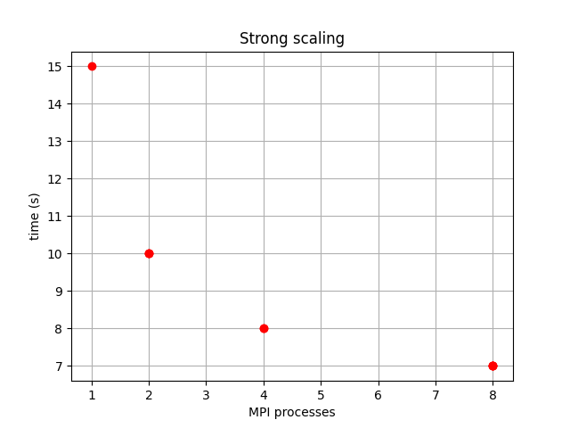
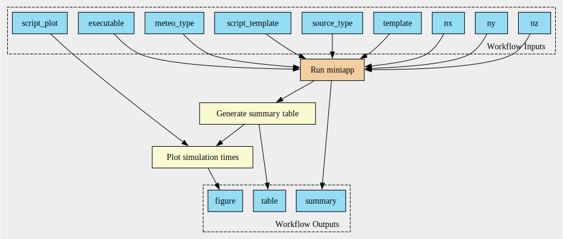
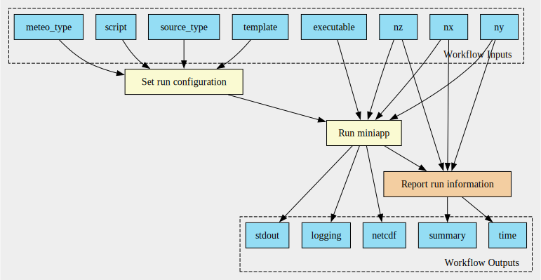

# CWL-based workflows for FALL3D

Workflows for the FALL3D model based on the [Common Workflow Language][cwl] 
(CWL) standard. 

## Folder structure
This is the folder structure:

* `base`: basic workflows intended to be used as reusable components
* `templates`: templates for some input files required by the model
* `scripts`: scripts invoked by different workflow components
* `examples`: some examples of practical workflows

## Running a workflow

A CWL runner is required for running CWL workflows. For example, you can
install `cwltool`, a Python Open Source project maintained by the CWL
community:

```console
pip install cwltool
```

You can run a workflow `workflow.cwl` with:
```console
cwltool workflows.cwl arguments.yaml
```
where you are passing values to your workflow input parameters via the yaml
file `arguments.yaml`.

## Workflow visualization in graphviz format 

Workflows can be visualized with using `cwltool`. A graph is generated with the
command:
```console
cwltool --print-dot workflow.cwl | dot -Tsvg -o workflow.svg
```

## Workflow example: miniapp strong scaling

An example of a workflow for a strong scaling can be found in the folder
`examples/strong_scaling/`. Run the example using the command:

```console
cwltool miniapp_strong_scaling.cwl arguments.yml
```

It runs the miniapp for different domain decomposition, reports simulation 
times and generates a plot. As a resulta, you should obtain a suumary table 
with running times (`summary.csv`) and a figure like this:



The graph for this workflow is shown in the following figure:



The block "Run miniapp" represents a subworkflow with the graph representation:



```{note}
More examples will be added to the folder `examples/`
```

<!---------{ Links }--------->
[cwl]: https://www.commonwl.org/
