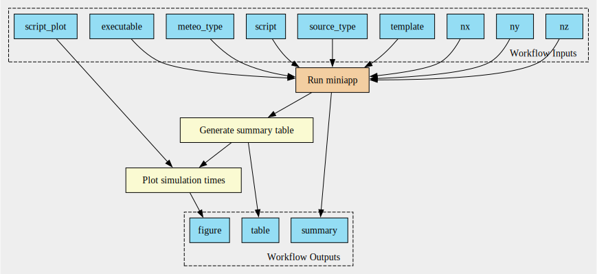

# Run example for strong scaling

Run the example to perform a strong scaling with the miniapp using the command:

```
cwltool --outdir outputs workflows/miniapp_scaling.cwl arguments-scaling.yml
```

It runs the miniapp, report simulation times and plot the results.

The workflow can be shown via:

```
cwltool --print-dot workflows/miniapp_scaling.cwl | dot -Tsvg > scaling.svg
```



# Examples

More examples in the folder `workflows/`
